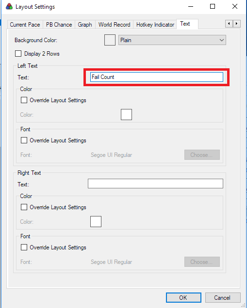

# LiveSplit Automatic Splitter for STATUS: INSANE

ASL file for LiveSplit automatic splitting, with the splits properly set up for the auto-splitter. Used to require a modified game .dll, but no longer does, as the required variables are now properly exposed in the official build as well.

## Latest updates

Resetting after a succesful run now works properly. If you wait the game outro and go to main menu, the run is automatically reset and the times are saved to the splits as they are supposed to be. You are now ready to start a new run if you wish.

Added logic to finishing a run - if you are on the last split, and change levels to a level that isn't the game outro, the split isn't activated and the run continues. Also, if you are not on the last split, but finish the run and it's requirements and go to the outro, the active split is changed to the last split and activated, in effect ending the run. This gives a bit more flexibility and means you can mess up, go keep changing levels, and still finish the run proper - the splits will be messed up, but that's not a biggie, the end time will be correct and without manual intervention. (Or possibly to find level skipping glitches and go to the end without finishing some levels, or perhaps changing the order and times changing a level, etc.)

Added 100% category selector to the automatic splitter. Remember to select which one you want with Layout->Scriptable Autosplitter Component. Default is disabled, so Any%.

Added collectible progress information for 100% runs. To update the info, you need text components with specific text in the Left Text -field. The following identifiers are supported:

 - ```Completion Rate``` - the overall completion rate
 - ```Hats Progress``` - the collection progress of hats
 - ```Arts Progress``` - the collection progress of fine pieces of art
 - ```Notes Progress``` - the collection progress of random notes
 - ```Fail Count``` - the number of times you have failed



The Right Text-field of the text component is then updated to reflect the progress of the current game. This value has two rows, so it's important to use Display 2 Rows -setting for the Text Components for it to render properly.

Included in this repo are example layouts for both Any% and 100% (with Fail Counts for Masochist runs). In these example files the Scriptable Autosplitter Component is set to the StatusInsane.asl - however, it won't work as the full path is needed. Replace this with the correct path to the file.

## Usage of ASL with LiveSplit

The ASL needs to be loaded with LiveSplit by adding a Scriptable Auto Splitter layout component (From Edit Layout...->[+ sign]) and adding the component from Control -menu. The settings can be reached by double clicking the component on the list. From there, selecting the ASL file from the Browse... -button should be enough. The game process should be automatically identified.

When the game is on the main menu, the timer is reset. When the first level is loaded (ie. the first frame where the current level is Igor's Room), the timer starts. All the splits are set to scene changes. 

There some detection for correct level changes, mainly so that the run doesn't end until you have changed to the game outro from the last level fulfilling all requirements. However, if something gets messed up, use the undo split key to get back on top of things (and the split key to go forwards, if you need it). The global hotkeys default to Numpad 1 for start/split and Numpad 8 for Undo Split.

The autosplit timer stops the on the last frame of the ending level before loading a the outro movie level. The timer is reset always in the main menu, whether a succesful run is currently displayed and finished or not. If the timer is reset with a succesful run, the splits are saved.

Sensing loading times is supported in both the modified game .dll as the autosplitter ASL file. To skip level loading from timer, remember to set the timer to Game Time from Compare Against in the context menu. This should happen currently automatically, but you can never be too sure.
